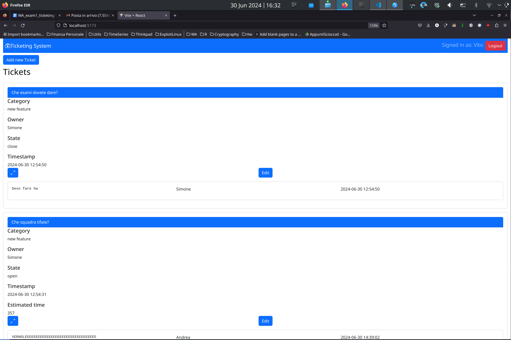
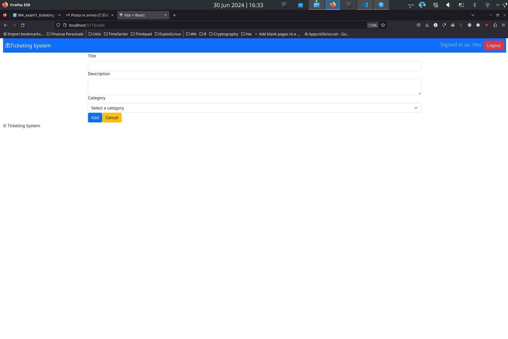

# Exam #1: "Ticketing system"


## React Client Application Routes

- Route `/`: this is the main route, where the list of all tickets is shown
- Route `/add/`: add form to add a ticket accessible by all the users(authenticated)
- Route `/edit/:id`: edit form when some normal user want to modify own tickets, or when an admin want to modify one of all the tickets
- Route `/confirmation`: confirmation page that can be accessed when some user want to add a ticket. This page summarize the ticket and add the estimation for expire time(in hours for admin and days for normal user)
- Route `/login:`: login page where a visitor of the site can authenticate
- Route `*`: for any other route there is the page of error for any toher routes requested

## API Server

* **GET /api/tickets**
    - Description: Get all the tickets ordered by decrrescent timestamp.
    - Request body: None
    - Code: `200 OK (success)`,`500 Internal Server Error`.
    - Response body: An array of objects, each describing a ticket.

  ```
  [{
    "id": 1, 
    "state": "open", 
    "owner": "user1", 
    "title": "Sample Ticket", 
    "timestamp": "2023-06-30 10:00:00", 
    "description": "This is a sample ticket",
    "category": "new feature"
  },
  ...]
  ```
  * **GET /api/tickets/:id/blocks**
    - Description: Get all blocks associated with a specific ticket, ordered by decrescent timestamp, for the logged user.
    - Request body: None
    - Code: `200 OK (success)`, `404 Not Found`,`500 Internal Server Error`.
    - Response body: An array of objects, each describing a block.

  ```
  [{
    "id": 1,
    "ticketId": 1,
    "text": "This is a sample block",
    "author": "user1",
    "timestamp": "2023-06-30 10:05:00"
  },
  ...]
  ```

* **POST /api/tickets**
  - Description: Create a new ticket, for the logged user.The timestamp is directly taken byh the server and the owner and ownerId from the credetials in the session.
  - Request body: JSON object with ticket details.

  ```
  {
    "category": "inquiry",
    "title": "New Inquiry",
    "description": "Details about the inquiry"
  }
  ```

  - Code: `201 Created `, `401 Unauthorized`, `422 Unprocessable Entity` ,`503 Service Unavailable`.
  - Response body: JSON object with the created ticket details.
  ```
  {
    "id": 2,
    "category": "inquiry",
    "owner": "user1",
    "timestamp": "2023-06-30 11:00:00",
    "title": "New Inquiry",
    "description": "Details about the inquiry",
    "ownerId": 1
  }
  ```

* **PUT /api/tickets/:id**
    - Description: Update an existing ticket, for the logged user.If the user is an admin i can change cateogry and state, while for normal user only edit on state is permitted. The request body will be the same and will be applied two different internal function for every role(the deeper security is in the sql query).Also the check on the normal user that is updating the ticket is done(supposed to modify only his own tickets)
    - Request body: JSON object with ticket details to update.

  ```
  {
    "category": "maintenance",
    "state": "close"
  }
  ```
  - Code: `200 OK (success, automatically managed by res)`, `401 Unauthorized`, `422 Unprocessable Entity` ,`503 Service Unavailable`.
  - Response body: JSON object with the number of updated rows.


* **POST /api/tickets/blocks**
    - Description: Add a block to an existing ticket,  for the logged user.
    - Request body: JSON object with block details.

  ```
  {
    "text": "This is a new block",
    "ticketId": 1
  }
  ```

  - Code: `201 Created (success)`, `401 Unauthorized`, `422 Unprocessable Entity` , `403 Forbidden` , `404  Not Found`, `503 Service Unavailable`.
  - Response body: JSON object with the created block details.

  ```
  {
    "id": 2,
    "text": "This is a new block",
    "author": "user1",
    "timestamp": "2023-06-30 11:05:00",
    "ticketId": 1
  }
  ```
### Authentication APIs

* **POST /api/sessions**
    - Description: Authenticate and login the user.
    - Request body: JSON object with username and password.

  ```
  {
    "username": "user1",
    "password": "password"
  }
  ```
  - Code: `200 OK (success)`, `401 Unauthorized` , `500 Internal Server Error`.
  - Response body: JSON object with the user details.

  ```
  {
    "id": 1,
    "username": "user1",
    "role": "user"
  }
  ```


* **DELETE /api/sessions/current**
    - Description: Logout the user.
    - Request body: None
    - Code: `200 OK`.


* **GET /api/sessions/current**
    - Description: Check whether the user is logged in or not.
    - Request body: None
    - Code: `200 OK` , `401 Unauthorized`.
    - Response body: JSON object with the user details if logged in.

  ```
  {
    "id": 1,
    "username": "user1",
    "role": "user"
  }
  ```

* **GET /api/auth-token**
    - Description: Returns an auth token for the logged-in user.
    - Request body: None
    - Code: `200 OK` or `401 Unauthorized`.
    - Response body: JSON object with the token and user role.

  ```
  {
    "token": "jwt-token",
    "authRole": "user"
  }
  ```

## API Server 2
* **POST /api/estimate**

    - Description: Estimates the resolution time for a ticket based on its state (open or closed) and the user's access level (admin or user).
    - Request Headers:
        Authorization: JWT token.
    - Request Body: JSON object with the ticket details.
    ```
    {
      "ticket": {
        "state": "open",
        "title": "Sample Ticket Title",
        "category": "maintenance"
      }
    }
    ```


  - Response Body:

  ```
  {
    "estimatedTime": 300 // Example value
  }
  ```

- Code: `200 OK`, `401 Unauthorized` if the ticket is closed.
Error Handling

  - Unauthorized Error:
        If the JWT token is missing or invalid, the server responds with a `401 Unauthorized` error.
        Example:
    ```
    {
      "errors": [
        {
          "param": "Server",
          "msg": "Authorization error",
          "path": "invalid_token"
        }
      ]
    }
    ```

## Database Tables

- Table `users`: _username_, _autogenerated_id_, _hash_, _salt_, _role_.   

  _username_: defines the name of every user that should be different for each user

- Table `blocks`: _autogenerated_id_,_text_, _timestamp_, _author_, _timestamp_, _ticketId_.     

- Table `tickets`: _autogenerated_id_, _category_, _state_,_owner_,_title_,_timestamp_,_ownerId_.   

## Main React Components
- `App` (defined in `App.jsx`): This component serves as the main controller for the entire application, managing its overall functionality and state.

- `TicketTable` (defined in `TicketTable.jsx`): this component displays a comprehensive list of all tickets currently in the system.

- `TicketRow` (defined in `TicketTable.jsx`): this component handles the representation and management of individual tickets within the application, including their estimation and associated blocks.

- `BlockTable` (defined in `BlockComponents.jsx`): this component provides a clear and organized view of all blocks available in the system.

- `BlockRow` (defined in `BlockComponents.jsx`): this component manages the display and functionality of each individual block.

- `MyForm` (defined in `TicketEdit.jsx`): this component handles the insertion or updating of ticket information within the application, including necessary validation and confirmation steps.

- `BlockForm` (defined in `BlockForm.jsx`): this component handles the process of adding new blocks, in a specific ticket, to the application's database, ensuring accurate data entry and validation prior to submission.

- `ConfirmationPage`(defined in `ConfirmationPage.jsx`): this components handle the confirmation page and make the fetch to the second server to retrieve the estimated expire time.

## Screenshot




## Users Credentials

| username | password | role |
|-------|----------|------|
|Vito | Vitoadmin01 | admin |
| Antonio | Vitoadmin01 | admin |
| Leonardo | Vitoadmin01 | user |
| Andrea | Vitoadmin01 | user |
| Simone | Vitoadmin01 |  user |


